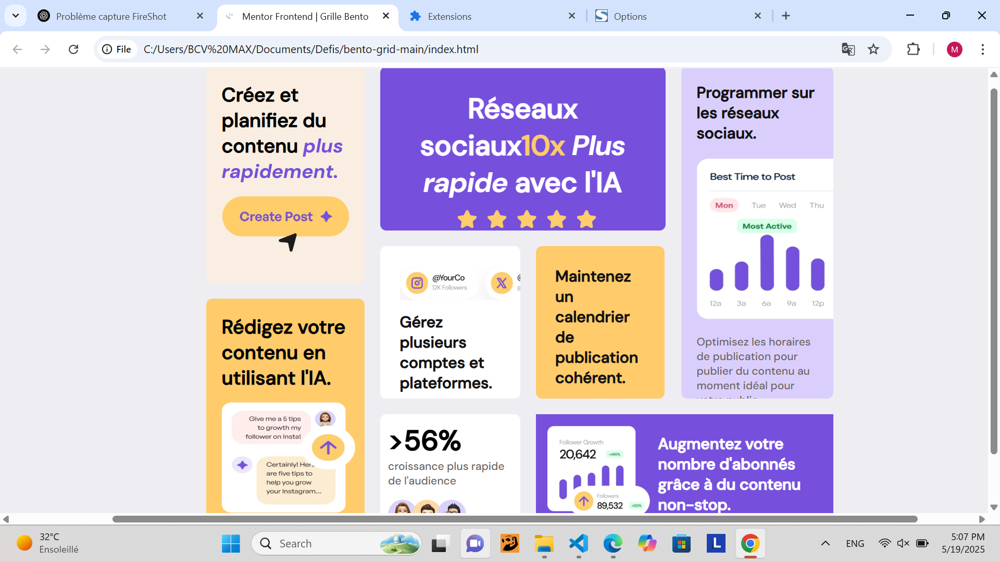

# Frontend Mentor - Bento grid solution

This is a solution to the [Bento grid challenge on Frontend Mentor](https://www.frontendmentor.io/challenges/bento-grid-RMydElrlOj). Frontend Mentor challenges help you improve your coding skills by building realistic projects. 

## Table of contents

- [Overview](#overview)
  - [The challenge](#the-challenge)
  - [Screenshot](#screenshot)
  - [Links](#links)
- [My process](#my-process)
  - [Built with](#built-with)
  - [What I learned](#what-i-learned)
  - [Continued development](#continued-development)
  - [Useful resources](#useful-resources)
- [Author](#author)
- [Acknowledgments](#acknowledgments)

## Overview

### The challenge

Users should be able to:

- View the optimal layout for the interface depending on their device's screen size

### Screenshot

### Links

- Solution URL: [https://github.com/MAXbcv/bento-grid]
- Live Site URL: [https://maxbcv.github.io/bento-grid/]

## My process

### Built with

- Semantic HTML5 markup
- CSS custom properties
- Flexbox

### What I learned

Through this challenge, I refined my skills in structuring and positioning elements within an interface.

### Continued development

### Useful resources

## Author

- GitHub : [@MAXbcv](https://github.com/MAXbcv)
- Frontend Mentor : [@MAXbcv](https://www.frontendmentor.io/profile/MAXbcv)

## Acknowledgments

Thanks to the Frontend Mentor community for the inspiration and the many shared examples. This challenge helped me improve my web development skills